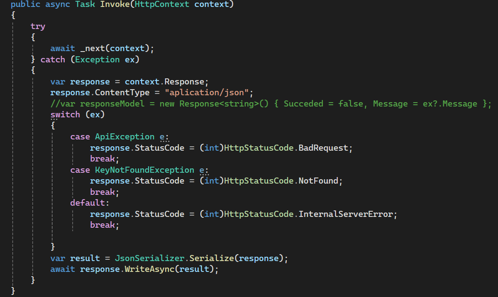

# Configuración del Proyecto:

El proyecto está estructurado con el patrón de diseño MVC y con el SDK de .NET versión 7.

Para ejecutar el proyecto de manera local se debe importar la base de datos de la carpeta "Data Base" y conectarla con el proyecto a través del [appsettings.json](./WebAPI/appsettings.json). Una vez conectada la base de datos se puede ejecutar el proyecto desde la terminal con el siguiente comando:

`dotnet run`

O también se puede abrir el proyecto desde Visual Studio 2022 y ejecutar el mismo.

El proyecto consiste en realizar operaciones CRUD, a través de operaciones REST con una API, a una base de datos de productos.

La distribución de las carpetas del proyecto es de la siguiente manera:

La base de datos tiene las siguientes tablas:

Esta parte del proyecto esta desarrollada a partir de los Modelos Categoría y Producto, que se encuentra en la carpeta “Models” y son clases con los atributos y métodos necesarios para la correcta estructura de los mismos.

Para las operaciones CRUD se realizan los métodos REST necesarios en la clase “ProductoController” que se encuentra en la carpeta “Controllers.” Aquí se realizan las siguientes operaciones:

■ GET(/api/Producto): Se obtiene la lista de los productos que se encuentran en la base de datos.

■ GET(/api/Producto/{id}): Se obtiene el producto con el “id” indicado.

■ POST(/api/Producto): Se ingresa un nuevo producto a la base de datos.

■ PUT(/api/Producto/edit): Actualiza los datos de un producto.

■ POST(/api/Producto/Delete/{id}): Elimina el producto del id indicado.

## Configuración del middleware de autenticación para utilizar tokens JWT

En el proyecto la autenticación se debe realizar para ejecutar el método de eliminar un producto, es decir, el usuario debe iniciar sesión como administrador para poder eliminar un producto de la base de datos.

Para realizar esto se crea un modelo Usuario con los siguientes atributos:

Luego, se genera una lista de usuarios que tienen que iniciar sesión para acceder al método delete, sin embargo, solo el usuario con el rol de “administrador” puede ejecutar este método.

El proceso de autenticación y generación del token funciona de la siguiente manera. La clase “UsuarioController,” en la carpeta “Controllers,” define el método REST “Login” para realizar el proceso de inicar sesión dentro de la aplicación.

Por ejemplo, vamos a iniciar sesión como “Juan” quien es “asesor.”

Nota: El body se debe enviar en formato JSON.

La aplicación responde con la generación del token:

Copiamos este Token y lo enviamos en el header de la solicitud del método de eliminar de la siguiente manera:

Primero, el url es: http://localhost:37469/api/Producto/Delete/3 y significa que vamos a eliminar el producto con el id 3. Luego en headers ingresamos en Key: Authorization y en Value: Bearer **token**.

Nota: Se debe ingresar la palabra “Bearer” y de ahí pegar el token, caso contrario, no se ejecuta conrrectamente.

La respuesta esta solicitud es la siguiente:

Esta respuesta es la esperada ya que iniciamos sesión como “asesor.” Ahora, si iniciamos sesión como administrador obtenemos la siguiente respuesta:

Finalmente, dentro del controlador del método delete de productos se encuntra instrucción [Authorize], el cuál exige al usuario primero iniciar sesión para tener acceso a este método.

# Seguridad y Middleware

La aplicación tiene un registro de todos los errores dentro del programa y de las solicitudes a la API antes y después del procesamiento. Esta configuración está dentro de las carpeta “Middlewares” y “Extensions.” Particularmete la clase “ErrorHandlerMiddleware” dentro de la carpeta “Middlewares” se encarga de estas operaciones.

# Conclusiones

En este proyecto, hemos explorado el desarrollo de una API segura utilizando [ASP.NET](http://asp.net/) Core. Hemos utilizado el patrón de diseño MVC y hemos trabajado con el SDK de .NET versión 7. Nuestro objetivo principal ha sido realizar operaciones CRUD a través de una API REST hacia una base de datos de productos.

Hemos estructurado adecuadamente nuestras carpetas y hemos definido los modelos necesarios para representar las entidades de Categoría y Producto. Además, hemos implementado los controladores necesarios para manejar las operaciones CRUD, como obtener la lista de productos, obtener un producto específico, agregar un nuevo producto, actualizar los datos de un producto y eliminar un producto.

Para garantizar la seguridad en nuestra API, hemos configurado un middleware de autenticación que utiliza tokens JWT. Esto nos permite limitar el acceso a ciertas operaciones, como la eliminación de un producto, solo a usuarios autenticados con el rol de administrador.

También hemos implementado un middleware de manejo de errores y registro de solicitudes, lo que nos permite realizar un seguimiento de los errores y las solicitudes a nuestra API.

En conclusión, este proyecto nos ha permitido desarrollar una API segura y robusta utilizando [ASP.NET](http://asp.net/) Core. Hemos aprendido sobre la estructura de un proyecto MVC, la implementación de operaciones CRUD y la configuración de middleware para garantizar la seguridad y el registro de errores. Este conocimiento nos será útil para futuros proyectos en el desarrollo de aplicaciones web avanzadas.
